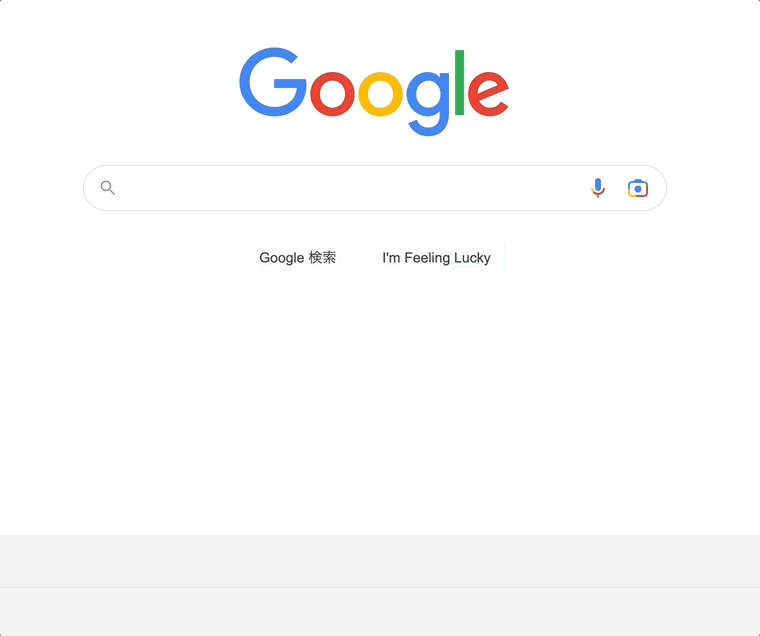
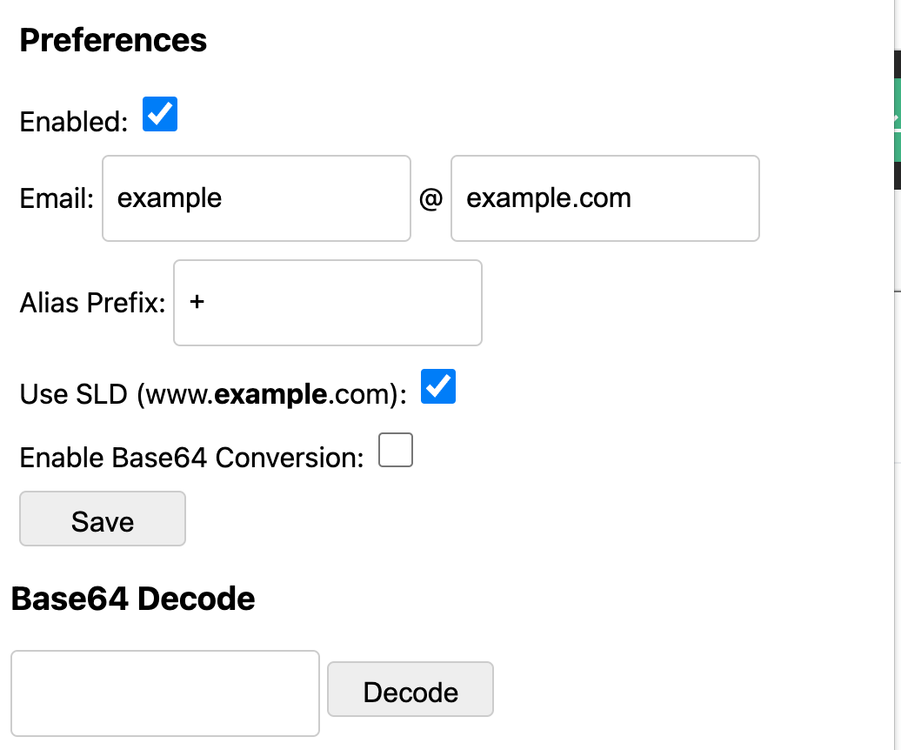

#  Alias Generator

Generate alias'd e-mail address by URL, from right click menu or keyboard shortcut




## Features

- Generate alias'd e-mail address

## Build

```bash
npm i && npm run build
```

## Contribution

Suggestions and pull requests are welcomed!

---

This project was bootstrapped with [Chrome Extension CLI](https://github.com/dutiyesh/chrome-extension-cli)
